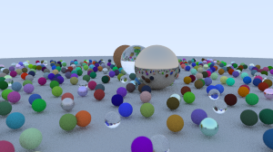

# tracer



A zig implementation of [ray tracing in a weekend](https://raytracing.github.io/books/RayTracingInOneWeekend.html).

```sh
# build ray tracer
zig build

# build ray tracer and world generator
zig build -Dgenerator=true

# build only generator
zig build generator

./zig-out/bin/zrt world.zon

./zig-out/bin/gen_world 0xdeadcafe > world.zon
```
